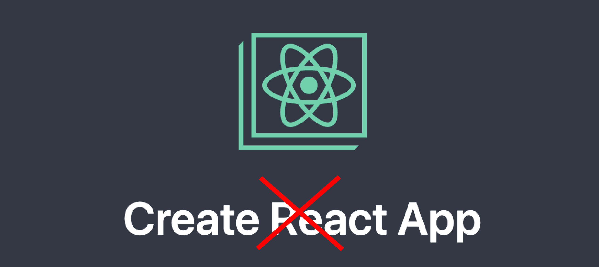

# without-create-react-app :sparkles:


Start your frontend react application without unnecessary boilerplate codes from &lt;npx create-react-app> :tada:

## Getting Started - Installation :computer:

```
1.  git clone https://github.com/Chabbax/without-create-react-app.git
2.  yarn
3.  yarn start
```
or

```
1.  git clone https://github.com/Chabbax/without-create-react-app.git
2.  npm install
3.  npm start
```

## Checklist :white_check_mark:
- [x] No boilerplate code
- [x] Lightweight and clean

